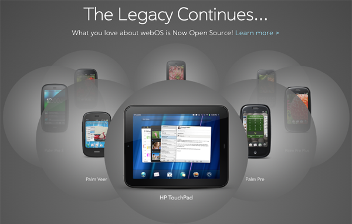

## webOS Archive

Palm and HP's webOS mobile platform was a relatively short-lived entry in the smart phone OS wars. Built-on Linux foundations, it leveraged web frameworks (NodeJS, and Mojo and Enyo front-end javascript libraries) to provide stunning UIs and a fluid multi-tasking environment on Palm Pre and Pixi, and HP Pre, Veer and Touchpad devices. Palm later added a PDK for interacting directly with the hardware. 

Because of the technology used, the platform, and its SDK, was incredibly developer-friendly and customizable, and pioneered a number of UI innovations that modern smart phones still copy. After its sale to HP, and its brief foray into tablet (and other) form factors, the platform was sold off to LG where its descendent is still used in their Smart TVs.

This is a fan-led effort to preserve and provide access to historical artifacts related to the platform, much of which was open source. We also provide new apps and services to keep the legacy devices functional. This project has no commercial intent or aspiration, and all historical materials are subject to fair use provisions of US copyright law, as the project serves the public interest in preservation, access and research. Additionally, since the webOS mobile platform has been obsolete since 2012, this work is exempted from the DMCA per a ruling by the U.S. Copyright office [updated in 2024](https://www.federalregister.gov/documents/2024/10/28/2024-24563/exemption-to-prohibition-on-circumvention-of-copyright-protection-systems-for-access-control). 

Notwithstanding the above, if you are a legitimate copyright holder and can demonstrate clear harm from the preservation of your historical materials, the owner of webOS Archive will respond promptly to take down requests. Contact information may be found at [webosarchive.org](http://www.webosarchive.org).

Among other resources, webOS Archive provides:
- A largely-restored archive of the SDK and PDK at [sdk.webosarchive.org](https://sdk.webosarchive.org)
- Help activating legacy devices, including drivers for modern platforms, at [docs.webosarchive.org](https://docs.webosarchive.org)
- New and restored apps from a gentler era of mobile development at [appcatalog.webosarchive.org](https://appcatalog.webosarchive.org)

If you code with an AI assistant, check-out a [knowledge-heavy MCP server](https://www.npmjs.com/package/webos-mcp) that can help you target this legacy OS.

You can run a webOS simulator on Android devices, that includes an in-development app compatibility layer, called [Lunacy](https://www.github.com/webosarchive.org/lunacy).

The community also contributes to an open source effort to modernize webOS, derived from HP and LG's OSS, called [LuneOS](https://www.luneos.org).
